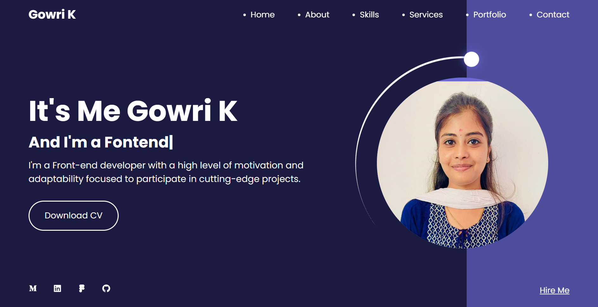

Leveraging my expertise in frontenddevelopment , I have carefully crafted each element of the  portfolio to be dynamic and responsive, ensuring optimal userexperience across various devices and  screen sizes.

 

I used  JavaScript to ensure a seamless  userform interaction while also improving functionality and datamanagement. 
💡 I have specifically created  JavaScriptfunctions that permit the incorporation of anExcelspreadsheet for effective  usermessage  storage. This not only demonstrates my mastery of sophisticated  programming hashtag#techniques, but also my dedication to producing a usercentric experience.

I'm setting up my  Netlify  webpage here for  additional information.
https://soft-choux-59fccb.netlify.app/
"# Portfolio-1" 
"# Portfolio-1" 
